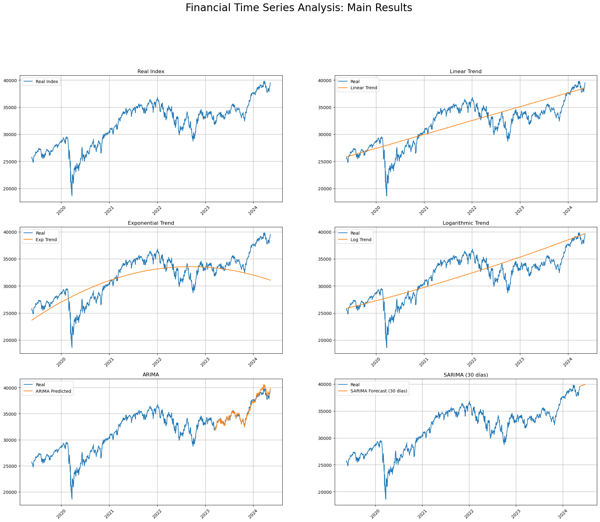

# Time Series Forecasting



## Overview

This repository contains an analysis and forecasting of financial time series data using various statistical and machine learning techniques. The notebook explores different methodologies for modeling and predicting time-dependent data, evaluating their performance to identify the most suitable approach.

## Goals

- Perform exploratory data analysis (EDA) on financial time series data.
- Apply and compare different forecasting techniques.
- Evaluate model performance using statistical and machine learning metrics.

## Methods & Techniques

- **Time Series Decomposition**: Identifying trend, seasonality, and residual components.
- **ARIMA & SARIMA Models**: Classical statistical models for time series forecasting.
- **Linear Regression**: Using machine learning to capture linear trends in the data.
- **Automated Model Selection**: Leveraging `pmdarima` for optimizing ARIMA parameters.
- **Performance Evaluation**: Utilizing RMSE, AIC, and other statistical metrics.

## Dependencies

Make sure you have the following Python libraries installed:

```bash
pip install pandas numpy matplotlib seaborn statsmodels scikit-learn pmdarima
```

## Usage

1. Clone the repository:
   ```bash
   git clone https://github.com/yourusername/time-series-forecasting.git
   ```
2. Open the Jupyter Notebook:
   ```bash
   jupyter notebook TP_Final.ipynb
   ```
3. Run the notebook cells to perform the analysis and forecasting.

## Results

- Visualization of time series trends and seasonal patterns.
- Comparison of different forecasting models and their accuracy.
- Insights into the best-performing model for financial forecasting.

## Author

Juan S. Vassallo

## License

This project is for educational purposes only.
